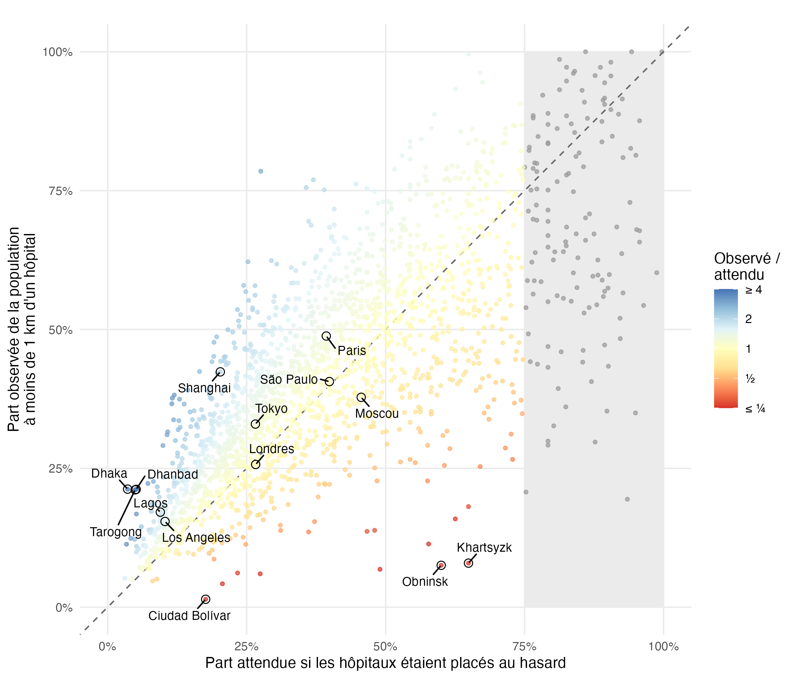

# 2026-09-29 · Accès aux soins dans les centres urbains

Données : [TidyTuesday 2026, semaine 39](https://github.com/rfordatascience/tidytuesday), GHSL Urban Centre Database.

ACP sur les densités, les nombres par habitant et les parts de population à moins de 1 km des hôpitaux et des pharmacies (2 248 centres urbains aux données complètes). Les deux premiers axes sont cartographiés, avec la médiane par pays (pays avec au moins 5 centres urbains) :

- PC1 (55 %) : accès global aux soins ;
- PC2 (30 %) : offre plutôt tournée vers les pharmacies ou vers les hôpitaux.

La couverture des données est très inégale (valeurs manquantes plus fréquentes dans les pays à faible revenu), et reflète sans doute en partie le recensement des établissements plus que l'offre réelle.

## Accès à l'hôpital : taille, densité et placement

Script : [`health_access.R`](health_access.R). Analyse réalisée avec [Claude Code](https://claude.com/claude-code), testé en vue d'une future formation.

On mesure l'accès par la part de la population vivant à moins de 1 km d'un hôpital. Seuls les 6 434 centres urbains où cette valeur est renseignée sont pris en compte. Les valeurs manquantes sont bien plus fréquentes dans les petits centres (54 % sous 100 000 habitants, aucune au-dessus de 5 millions) : il s'agit souvent de centres sans hôpital recensé.

### Taille ou densité ?

L'accès varie peu avec la population du centre urbain (ρ de Spearman = −0,13), mais augmente nettement avec la densité de population (ρ = 0,32). Les régions aux villes les plus étalées ont l'accès le plus faible : médiane de 12 % en Amérique du Nord et de 17 % en Australie–Nouvelle-Zélande, contre 30 à 38 % ailleurs.

### Les hôpitaux sont-ils là où vivent les gens ?

On compare la couverture observée à celle qu'on obtiendrait avec le même nombre d'hôpitaux placés au hasard sur la même surface (modèle nul : `1 − exp(−n·π/surface)`). Au-dessus de la diagonale, les hôpitaux sont mieux placés que le hasard.

Dans 68 % des 1 904 centres retenus (au moins 5 hôpitaux), les hôpitaux font mieux que le hasard (rapport médian : 1,15). L'Europe est la seule région au niveau du hasard (0,94), l'Asie de l'Est et du Sud-Est la plus haute (1,41).

Quand la couverture attendue dépasse 75 %, une ville ne peut plus faire mieux qu'un tiers au-dessus du hasard : la comparaison ne permet plus de trancher, ces centres sont grisés. Les nombres d'hôpitaux sont divisés par deux, car 95 % d'entre eux sont pairs (double comptage probable).

### Pharmacies ou hôpitaux ?

Nombre de pharmacies par hôpital, par pays (au moins 10 centres urbains renseignés). L'Espagne et l'Italie, connues pour leurs réseaux de pharmacies très denses, sont parmi les plus basses : ce ratio reflète sans doute davantage le recensement des établissements par la source que l'offre réelle.

