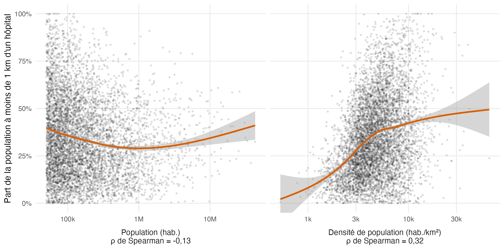

# 2026-09-29 · Accès aux soins dans les centres urbains

Données : [TidyTuesday 2026, semaine 39](https://github.com/rfordatascience/tidytuesday), GHSL Urban Centre Database.

ACP sur les densités, les nombres par habitant et les parts de population à moins de 1 km des hôpitaux et des pharmacies (2 248 centres urbains aux données complètes). Les deux premiers axes sont cartographiés, avec la médiane par pays (pays avec au moins 5 centres urbains) :

- PC1 (55 %) : accès global aux soins ;
- PC2 (30 %) : offre plutôt tournée vers les pharmacies ou vers les hôpitaux.

La couverture des données est très inégale (valeurs manquantes plus fréquentes dans les pays à faible revenu), et reflète sans doute en partie le recensement des établissements plus que l'offre réelle.

## Taille ou densité ?

Script : [`health_density.R`](health_density.R).

Les grandes villes offrent-elles un meilleur accès à l'hôpital ? Pas vraiment : la part de la population à moins de 1 km d'un hôpital varie peu avec la population du centre urbain (ρ de Spearman = −0,13), mais augmente nettement avec la densité de population (ρ = 0,32). Les régions aux villes les plus étalées ont l'accès le plus faible : médiane de 12 % en Amérique du Nord et de 17 % en Australie–Nouvelle-Zélande, contre 30 à 38 % ailleurs.

Seuls les 6 434 centres urbains où la valeur est renseignée sont pris en compte. Les valeurs manquantes sont bien plus fréquentes dans les petits centres (54 % sous 100 000 habitants, aucune au-dessus de 5 millions) : il s'agit souvent de centres sans hôpital recensé, ce que la figure ne montre pas.

