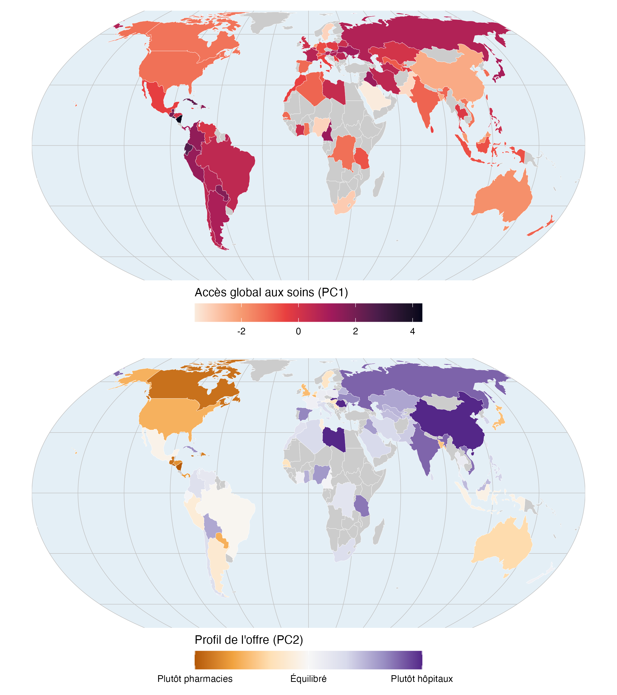

# tidytuesday

Mes contributions à [#TidyTuesday](https://github.com/rfordatascience/tidytuesday), en R.

Un dossier par semaine, `AAAA/AAAA-MM-JJ/`, avec le script et la figure.

| Date | Jeu de données | Analyse | Figure |
|---|---|---|---|
| 2026-09-29 | Accès aux soins dans les centres urbains | ACP (FactoMineR) et cartes des deux premiers axes |  |

## Reproduire

Les dépendances sont gérées avec [renv](https://rstudio.github.io/renv/) : ouvrir le projet à la racine, lancer `renv::restore()`, puis exécuter le script de la semaine.
